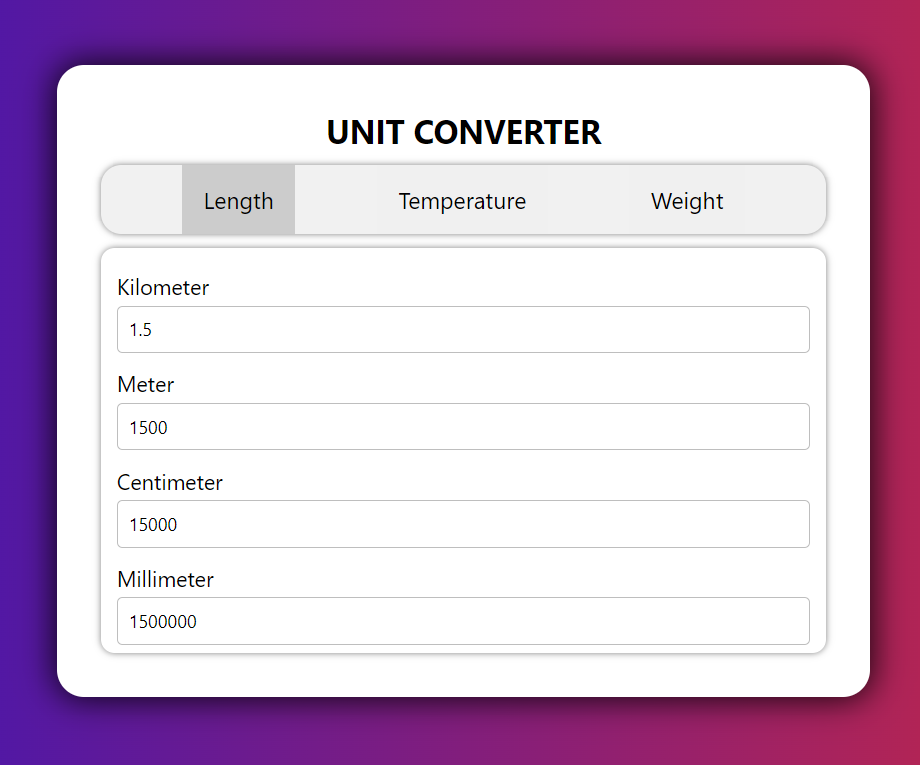

# Unit Converter

This is a simple web application for converting units of measurement. The tool currently supports converting units for length, temperature, and weight.

## Installation

To use the Unit Converter, simply open the [index.html](/index.html) file in your web browser. There is no need to install any additional software. The Unit Converter is also available online at [Unit Converter](https://ravirajkumartiwari.github.io/CodeClause_unit_converter/).

## Usage

To use the Unit Converter, select the type of unit you want to convert (length, temperature, or weight). Then, enter the value you want to convert in the input field. The result of the conversion will be displayed in the output field.

## Supported Units

### **Length**

- Kilometers (km)
- Meters (m)
- Centimeters (cm)
- Millimeters (mm)

### **Temperature**

- Celsius (C)
- Fahrenheit (F)
- Kelvin (K)

### **Weight**

- Kilograms (kg)
- Grams (g)
- Milligrams (mg)
- Pounds (lb)

## Preview

## Technologies used

- HTML
- CSS
- JavaScript
